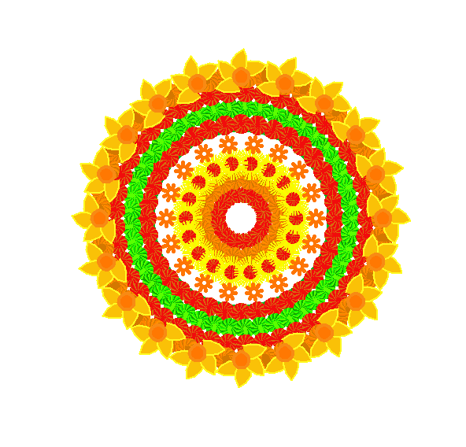

# 🌸 Jenin's Pookalam 2025 🌸

## 👨‍💻 About Me
- **Name: Jenin Cheriyan** 
- **Institution/Company: RIT Kottayam**
- **GitHub: [@jenincheriyan](https://github.com/jenincheriyan)**
- **Programming Language Used: Python ** 

## 🎨 My Pookalam

### Description
I made this pookalam with python turtle module, first I made a few functions to generate patterns like spiral, flower, diamond, circular, petals, and then i combined each pattern accordingly.

### Preview


### Features
- Radial symmetry followed.
- Bright colour combinations are used.
- Flower patterns are used.
- different patterns are used to make it more attractive

## 🚀 How to Run

### Prerequisites
pip install turtle
```

### Running the Code
```bash

python3 pookalam.py
```

## 📁 File Structure
```
Code-a-Pookalam-2025/
├── README.md
├── pookalam.py 
└── Screenshot.png

